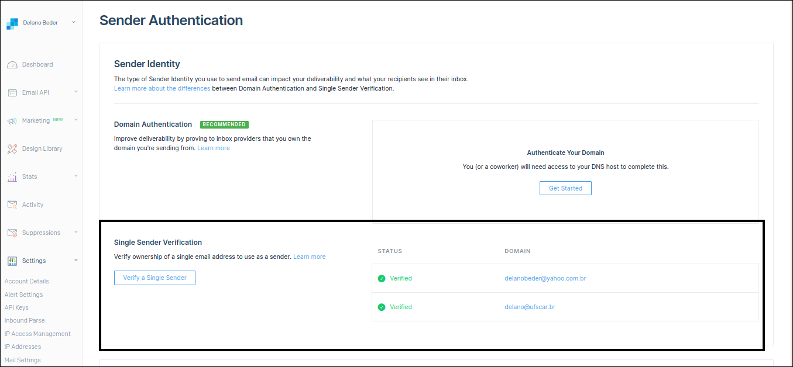

## DESENVOLVIMENTO DE SOFTWARE PARA A WEB 1
**Prof. Delano M. Beder (UFSCar)**

**Envio de *emails***

- - -

#### 03 - Envio de *emails* (SendGrid)
[Código](https://github.com/delanobeder/DSW1/blob/master/SendMail/SendGrid)
- - -

1. Faça o cadastro em https://signup.sendgrid.com/
   
   
   
   
   


2. Crie uma nova chave e atualize o arquivo **src/main/resources/config.properties** com as informações da chave gerada (https://app.sendgrid.com/settings/api_keys)

   Maiores informações: https://sendgrid.com/docs/ui/account-and-settings/api-keys/
   
   ```properties
   API_KEY = <chave com 69 caracteres>
   ```
   
   

<div style="page-break-after: always"></div>


3. Adicione os endereços que serão utilizados no envio de mensagens. Apenas esses endereços serão permitidos (propriedade **from** da mensagem) a enviar mensagens.

    (https://app.sendgrid.com/settings/sender_auth)
    
    
    
    
    
4. Atualize o arquivo **src/main/java/br/ufscar/dc/dsw/Main.java** com endereços válidos (Variáveis **from** e **to**). O endereço **from** deve constar na lista de endereços verificados (passo anterior)

    ```java
    package br.ufscar.dc.dsw;
    
    import java.io.File;
    import java.io.IOException;
    
    import com.sendgrid.helpers.mail.objects.Email;
    
    public class Main {
    	public static void main(String[] args) throws IOException {
    		
    		EmailService service = new EmailService();
    		
    		Email from = new Email("fulano@dsw.ufscar.br", "Fulano"); // Atualize
    		Email to = new Email("beltrano@dsw.ufscar.br", "Beltrano"); // Atualize
    
    		String subject1 = "Exemplo Subject (SendGrid/Java)";
    		String subject2 = "Exemplo Subject com Anexo (SendGrid/Java)";
    
    		String body1 = "Exemplo mensagem (SendGrid/Java)";
    		String body2 = "Exemplo mensagem com Anexo (SendGrid/Java)";
    
    		// Envio sem anexo
    		service.send(from, to, subject1, body1);
    
    		// Envio com anexo
    		service.send(from, to, subject2, body2, new File("SIGA.pdf"));
    	}
    }
    ```
    
    
<div style="page-break-after: always"></div>

5. Abrir um terminal dentro da pasta do projeto e executar os seguintes comandos:

    ```sh
    % ./mvnw compile
    % ./mvnw exec:java
    ```

    

6. Verificar se duas mensagens foram recebidas
    Abrir o *inbox* do endereço setado na variável **to**. 

    

7. Fim


#### Leituras adicionais

- - -
- SendGrid Java 

  https://github.com/sendgrid/sendgrid-java

  

- SendGrid v3 API Java Code Example

  https://sendgrid.com/docs/for-developers/sending-email/v3-java-code-example/