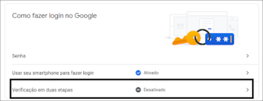
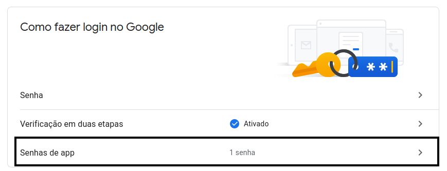

## DESENVOLVIMENTO DE SOFTWARE PARA A WEB 1
**Prof. Delano M. Beder (UFSCar)**

**Envio de *emails***

- - -

#### 04 - Envio de *emails* (Gmail SMTP + Spring Email)
[Código](https://github.com/delanobeder/DSW1/blob/master/SendMail/GmailSMTP)

- - -


1. É necessário ter uma conta (endereço) Gmail: [username]@gmail.com
    Obs: os emails institucionais ([username]@estudante.ufscar.br) também podem ser utilizados 

2. Atualize o arquivo **src/main/resources/application.properties** com informações do cadastro (*username* e *password*)

   ```properties
   spring.mail.host = smtp.gmail.com
   spring.mail.port = 465
   spring.mail.properties.mail.smtp.auth = true
   spring.mail.properties.mail.smtp.ssl.enable = true
   spring.mail.username = [username]@gmail.com
   spring.mail.password = <password>
   ```
   
3. Caso a **<u>Verificação em duas etapas</u>** esteja desativada, é necessário ativar o **<u>Acesso a app menos seguro</u>** para permitir que seu programa Java acesse o Gmail SMTP

    

        

<div style="page-break-after: always"></div>

4. Caso a **<u>Verificação em duas etapas</u>** esteja ativada, é necessário criar uma **Senha de app** para permitir que seu programa Java acesse o Gmail SMTP. Utilize essa senha no arquivo **config.properties** discutido anteriormente.

    Maiores informações: https://support.google.com/accounts/answer/185833?hl=pt-BR

    

    

5. Atualize o arquivo **src/main/java/br/ufscar/dc/dsw/SpringEmailApplication.java** com endereços válidos (Variáveis **from** e **to**). O endereço **from** deve ser [username]@gmail.com (ou [username]@estudante.ufscar.br) usado no acesso ao Gmail SMTP.

    ```java
    package br.ufscar.dc.dsw;
    
    import java.io.File;
    
    import javax.mail.internet.InternetAddress;
    
    import org.springframework.boot.CommandLineRunner;
    import org.springframework.boot.SpringApplication;
    import org.springframework.boot.autoconfigure.SpringBootApplication;
    import org.springframework.context.annotation.Bean;
    
    @SpringBootApplication
    public class SpringEmailApplication {
    
    	public static void main(String[] args) {
    		SpringApplication.run(SpringEmailApplication.class, args);
    	}
    
    	@Bean
    	public CommandLineRunner run(EmailService service) {
    		return (args) -> {
    
                InternetAddress from = new InternetAddress("<username>@gmail.com", "Fulano");
    		    InternetAddress to = new InternetAddress("<email>@<dominio>", "Beltrano");
    					
    			String subject1 = "Exemplo Subject (Gmail SMTP/Spring)";
    			String subject2 = "Exemplo Subject com Anexo (Gmail SMTP/Spring)";
    
    			String body1 = "Exemplo mensagem (Gmail SMTP/Spring)";
    			String body2 = "Exemplo mensagem com Anexo (Gmail SMTP/Spring)";
    
    			// Envio sem anexo
    			service.send(from, to, subject1, body1);
    
    			// Envio com anexo
    			service.send(from, to, subject2, body2, new File("SIGA.pdf"));
    		};
    	}
    }
    ```

6. Abrir um terminal dentro da pasta do projeto e executar o seguinte comando:

    ```sh
    % ./mvnw spring-boot:run
    ```
    
7. Verificar se duas mensagens foram enviadas e recebidas. Abrir o *inbox* do endereço setado na variável **to**. 

8. Fim


#### Leituras adicionais

- - -
- Guide to Spring Email

  https://www.baeldung.com/spring-email