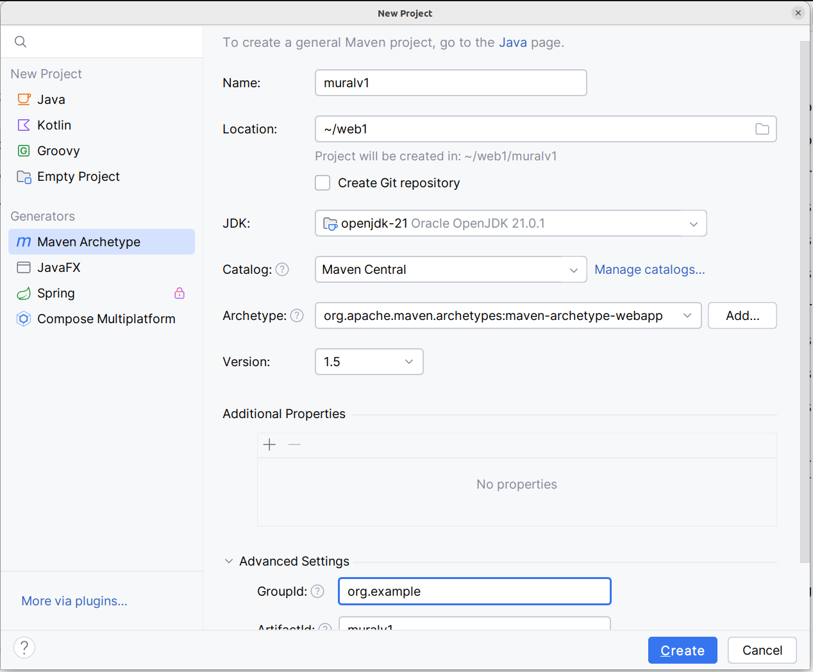

Criar um servlet que simula um mural em memória.

- Criar o projeto usando o wizard do Intellij; ver imagem abaixo.



- Configure o pom.xml e adicione as dependências conforme visto previamente. Assim, seu arquivo pom.xml deve estar parecido com o arquivo a seguir.

```xml
<?xml version="1.0" encoding="UTF-8"?>

<project xmlns="http://maven.apache.org/POM/4.0.0" xmlns:xsi="http://www.w3.org/2001/XMLSchema-instance"
  xsi:schemaLocation="http://maven.apache.org/POM/4.0.0 http://maven.apache.org/xsd/maven-4.0.0.xsd">
  <modelVersion>4.0.0</modelVersion>

  <groupId>org.example</groupId>
  <artifactId>muralv1</artifactId>
  <version>1.0-SNAPSHOT</version>
  <packaging>war</packaging>

  <name>muralv1 Maven Webapp</name>

  <properties>
    <project.build.sourceEncoding>UTF-8</project.build.sourceEncoding>
    <maven.compiler.source>21</maven.compiler.source>
    <maven.compiler.target>21</maven.compiler.target>
  </properties>

  <dependencies>
    <dependency>
      <groupId>jakarta.servlet</groupId>
      <artifactId>jakarta.servlet-api</artifactId>
      <version>6.0.0</version>
      <scope>provided</scope>
    </dependency>
    <dependency>
      <groupId>jakarta.servlet.jsp</groupId>
      <artifactId>jakarta.servlet.jsp-api</artifactId>
      <version>3.0.0</version>
      <scope>provided</scope>
    </dependency>
    <dependency>
      <groupId>io.vavr</groupId>
      <artifactId>vavr</artifactId>
      <version>0.10.4</version>
    </dependency>
    <dependency>
      <groupId>junit</groupId>
      <artifactId>junit</artifactId>
      <version>4.13.1</version>
      <scope>test</scope>
    </dependency>
  </dependencies>

  <build>
    <finalName>muralv1</finalName>
    <plugins>
      <plugin>
        <groupId>org.apache.tomcat.maven</groupId>
        <artifactId>tomcat7-maven-plugin</artifactId>
        <version>2.2</version>
        <configuration>
          <url>http://localhost:8080/manager/text</url>
          <server>Tomcat11</server>
          <path>/${project.artifactId}</path>
        </configuration>
      </plugin>
    </plugins>

    <pluginManagement><!-- lock down plugins versions to avoid using Maven defaults (may be moved to parent pom) -->
      <plugins>
        <plugin>
          <artifactId>maven-clean-plugin</artifactId>
          <version>3.4.0</version>
        </plugin>
        <!-- see http://maven.apache.org/ref/current/maven-core/default-bindings.html#Plugin_bindings_for_war_packaging -->
        <plugin>
          <artifactId>maven-resources-plugin</artifactId>
          <version>3.3.1</version>
        </plugin>
        <plugin>
          <artifactId>maven-compiler-plugin</artifactId>
          <version>3.13.0</version>
        </plugin>
        <plugin>
          <artifactId>maven-surefire-plugin</artifactId>
          <version>3.3.0</version>
        </plugin>
        <plugin>
          <artifactId>maven-war-plugin</artifactId>
          <version>3.4.0</version>
        </plugin>
        <plugin>
          <artifactId>maven-install-plugin</artifactId>
          <version>3.1.2</version>
        </plugin>
        <plugin>
          <artifactId>maven-deploy-plugin</artifactId>
          <version>3.1.2</version>
        </plugin>
      </plugins>
    </pluginManagement>
  </build>
</project>

```

- Dentro da pasta main, crie o pacote org.example e adicione as classes a seguir:
    - Veja mais sobre Java Records em https://www.baeldung.com/java-record-keyword

```java
// Mensagem.java
package org.example;

import java.util.Date;

public record Mensagem(int iid,
                       String enviadoPor,
                       String enviadoPara,
                       String texto,
                       Date timestamp) { }
```

```java
// Mural.java
package org.example;

import java.util.ArrayList;
import java.util.Date;
import java.util.List;
import java.util.logging.Logger;

public class Mural {
    private static Logger logger = Logger.getLogger(Mural.class.getName());
    private List<Mensagem> mensagens;

    // construtor
    public Mural() {
        logger.info("Mural Construtor");
        mensagens = new ArrayList<>();
        // simula 2 mensagens existentes
        mensagens.add(new Mensagem(1, "andre", "turma", "Oi pesssoal!", new Date()));
        mensagens.add(new Mensagem(2, "Terminator", "John Connor", "I'll be back!", new Date()));
    }

    public List<Mensagem> getMensagens() {
        return mensagens;
    }

    public void addMensagem(String de, String para, String texto) {
        int iid = mensagens.size() + 1;
        var novaMsg = new Mensagem(iid, de, para, texto, new Date());
        mensagens.add(novaMsg);
    }
}
```

- Implemente o Servlet a seguir. Estude as APIs utilizadas e como a aplicação funciona.

```java
// MainServlet.java
package org.example;

import io.vavr.control.Option;
import jakarta.servlet.ServletException;
import jakarta.servlet.annotation.WebServlet;
import jakarta.servlet.http.HttpServlet;
import jakarta.servlet.http.HttpServletRequest;
import jakarta.servlet.http.HttpServletResponse;

import java.io.IOException;
import java.io.PrintWriter;
import java.util.logging.Logger;

@WebServlet(urlPatterns = {"/*"})
public class MainServlet extends HttpServlet {

    private Mural mural = new Mural();

    private static Logger logger = Logger.getLogger(MainServlet.class.getName());

    @Override
    protected void doGet(HttpServletRequest req, HttpServletResponse resp) throws ServletException, IOException {
        processRequest(req, resp);
    }

    @Override
    protected void doPost(HttpServletRequest req, HttpServletResponse resp) throws ServletException, IOException {
        processRequest(req, resp);
    }

    public void processRequest(HttpServletRequest req, HttpServletResponse resp) throws ServletException, IOException {
        String rota = Option.of(req.getPathInfo()).getOrElse("");

        if (rota.equals("/postar")) {
            logger.info("Rota /postar");
            var enviadoPor = Option.of(req.getParameter("enviadoPor")).getOrElse("");
            if (enviadoPor.equals(""))
                enviadoPor = "Desconhecido";
            var enviadoPara = Option.of(req.getParameter("enviadoPara")).getOrElse("");
            if (enviadoPara.equals(""))
                enviadoPara = "Desconhecido";
            var texto = Option.of(req.getParameter("texto")).getOrElse("");
            if (texto.equals(""))
                texto = "Sem mensagem escrita.";

            mural.addMensagem(enviadoPor, enviadoPara, texto);
            // redireciona para a rota listar
            resp.sendRedirect("listar");
        } else if (rota.equals("/listar")) {
            logger.info("Rota /listar");

            resp.setContentType("text/html;charset=UTF-8");
            PrintWriter out = resp.getWriter();
            out.println("<html>");
            out.println("<head>");
            out.println("<title>Mural V1</title>");
            out.println("</head>");
            out.println("<body>");
            out.println("<h1>Mural</h1>");
            String htmlForm = """
                        <h2>Enviar Mensagem</h2>
                        <form action="postar" method="post">
                            <label for="enviadoPor">Enviado por:</label><br>
                            <input type="text" name="enviadoPor"><br><br>
                    
                            <label for="enviadoPara">Enviado para:</label><br>
                            <input type="text" name="enviadoPara"><br><br>
                    
                            <label for="texto">Mensagem:</label><br>
                            <textarea name="texto" rows="6" cols="40"></textarea><br><br>
                    
                            <button type="submit">Enviar</button>
                        </form>
                    """;
            out.println(htmlForm);
            out.println("<br><br><h2>Mensagens no mural:</h2><br>");
            logger.info("Mensagens atuais: " + mural.getMensagens());
            mural.getMensagens().forEach(mensagem -> {
                out.println(String.format("<div><div><strong>De:</strong> %s &nbsp; <strong>Para:</strong> %s (em %s)</div>",
                                mensagem.enviadoPor(),
                                mensagem.enviadoPara(),
                                mensagem.timestamp())
                );
                out.println(String.format("<div >%s</div></div>", mensagem.texto()));
                out.println("<br>");
            });

            out.println("</body>");
            out.println("</html>");
            out.close();
        } else {
            logger.info("Rota não definida: " + rota);

            resp.setContentType("text/html;charset=UTF-8");
            PrintWriter out = resp.getWriter();
            out.println("<html>");
            out.println("<head>");
            out.println("<title>Erro</title>");
            out.println("</head>");
            out.println("<body>");
            out.println("<h1>Erro</h1>");
            out.println("<h2>Rota não definida: " + rota + "</h2>");
            out.println("</body>");
            out.println("</html>");
            out.close();
        }
    }
}
```

- MODIFICAÇÃO 1: Mova o código que trata das 3 rotas (postar, listar, erro) para uma nova classe. Nesta nova classe, cada rota deve ser tratada em um método específico. 

- MODIFICAÇÃO 2: Vamos modificar o código para evitar múltiplas linhas para imprimir código HTML. Crie na raiz do projeto uma pasta pages e adicione arquivos HTML das páginas. 

```java
        String htmlContent = Files.readString(Path.of("/home/andre/web1/muralv1/pages/erro.html"));
        htmlContent = htmlContent.replace("__ROTA__", rota);
        resp.setContentType("text/html;charset=UTF-8");
        PrintWriter out = resp.getWriter();
        out.println(htmlContent);
        out.close();
```
    - Perceba que esse HTML tem uma parte dinâmica, a solução usada foi adicionar a keyword `__ROTA__` no arquivo HTML e trocar ela pelo conteúdo dinâmico usando o método replace() da classe String. Veja o HTML a seguir:

```html
<html>
<head>
    <title>Erro</title>
</head>
<body>
<h1>Erro</h1>
<h2>Rota não definida: __ROTA__</h2>
</body>
</html>
```
    - Implemente um mecanismo similar para a página principal do mural. 

- MODIFICAÇÃO 3: Melhore visualmente a apresentação das páginas usando alguns recursos de HTML e CSS. Use JavaScript para fazer algumas validações básicas no formulário. Neste caso, adicione códigos CSS e JavaScript dentro da tag `<head>` para simplificar.  