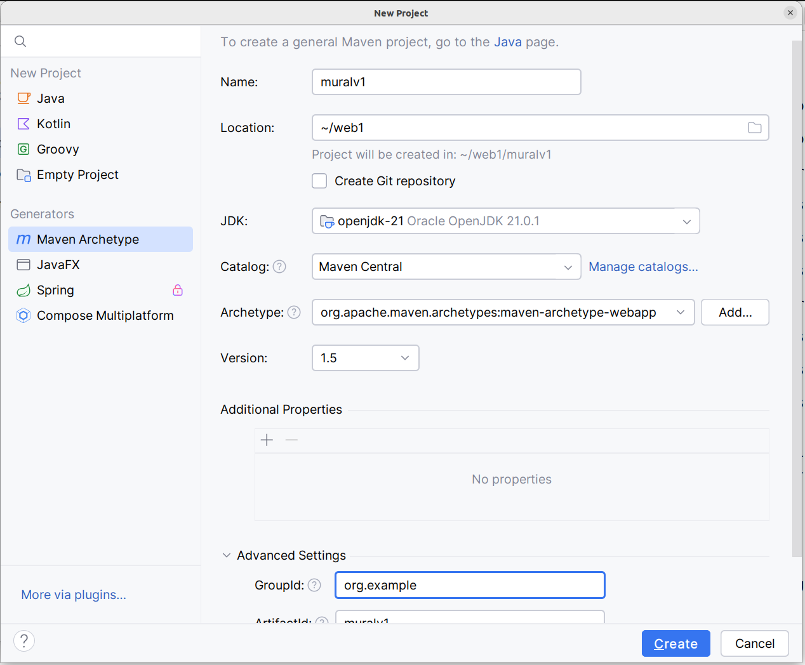

- Criar o projeto usando o wizard do Intellij; ver imagem abaixo.



- Configure o pom.xml e adicione as dependências conforme visto previamente. Assim, seu arquivo pom.xml deve estar parecido com o arquivo a seguir.

```xml
<?xml version="1.0" encoding="UTF-8"?>

<project xmlns="http://maven.apache.org/POM/4.0.0" xmlns:xsi="http://www.w3.org/2001/XMLSchema-instance"
  xsi:schemaLocation="http://maven.apache.org/POM/4.0.0 http://maven.apache.org/xsd/maven-4.0.0.xsd">
  <modelVersion>4.0.0</modelVersion>

  <groupId>org.example</groupId>
  <artifactId>projweb1</artifactId>
  <version>1.0-SNAPSHOT</version>
  <packaging>war</packaging>

  <name>projweb1 Maven Webapp</name>
  <!-- FIXME change it to the project's website -->
  <url>http://www.example.com</url>

  <!-- AQUI MUDEI A VERSÃO DO JAVA -->
  <properties>
    <project.build.sourceEncoding>UTF-8</project.build.sourceEncoding>
    <maven.compiler.source>21</maven.compiler.source>
    <maven.compiler.target>21</maven.compiler.target>
  </properties>

  <dependencies>
    <dependency>
      <groupId>junit</groupId>
      <artifactId>junit</artifactId>
      <version>4.13.1</version>
      <scope>test</scope>
    </dependency>

    <!-- AQUI ADICIONEI DEPENDÊNCIAS -->
    <dependency>
      <groupId>jakarta.servlet</groupId>
      <artifactId>jakarta.servlet-api</artifactId>
      <version>6.0.0</version>
      <scope>provided</scope>
    </dependency>
    <dependency>
      <groupId>jakarta.servlet.jsp</groupId>
      <artifactId>jakarta.servlet.jsp-api</artifactId>
      <version>3.0.0</version>
      <scope>provided</scope>
    </dependency>
  </dependencies>

  <build>
    <finalName>projweb1</finalName>

    <!-- AQUI ADICIONEI PLUGIN PARA O TOMCAT -->
    <plugins>
      <plugin>
        <groupId>org.apache.tomcat.maven</groupId>
        <artifactId>tomcat7-maven-plugin</artifactId>
        <version>2.2</version>
        <configuration>
          <url>http://localhost:8080/manager/text</url>
          <server>Tomcat11</server>
          <path>/${project.artifactId}</path>
        </configuration>
      </plugin>
    </plugins>

    <pluginManagement><!-- lock down plugins versions to avoid using Maven defaults (may be moved to parent pom) -->
      <plugins>
        <plugin>
          <artifactId>maven-clean-plugin</artifactId>
          <version>3.4.0</version>
        </plugin>
        <!-- see http://maven.apache.org/ref/current/maven-core/default-bindings.html#Plugin_bindings_for_war_packaging -->
        <plugin>
          <artifactId>maven-resources-plugin</artifactId>
          <version>3.3.1</version>
        </plugin>
        <plugin>
          <artifactId>maven-compiler-plugin</artifactId>
          <version>3.13.0</version>
        </plugin>
        <plugin>
          <artifactId>maven-surefire-plugin</artifactId>
          <version>3.3.0</version>
        </plugin>
        <plugin>
          <artifactId>maven-war-plugin</artifactId>
          <version>3.4.0</version>
        </plugin>
        <plugin>
          <artifactId>maven-install-plugin</artifactId>
          <version>3.1.2</version>
        </plugin>
        <plugin>
          <artifactId>maven-deploy-plugin</artifactId>
          <version>3.1.2</version>
        </plugin>
      </plugins>
    </pluginManagement>
  </build>
</project>
```

- Criar o executável

```sh
mvn -N io.takari:maven:wrapper
```

- Criar a pasta main/java onde as classes serão introduzidas.