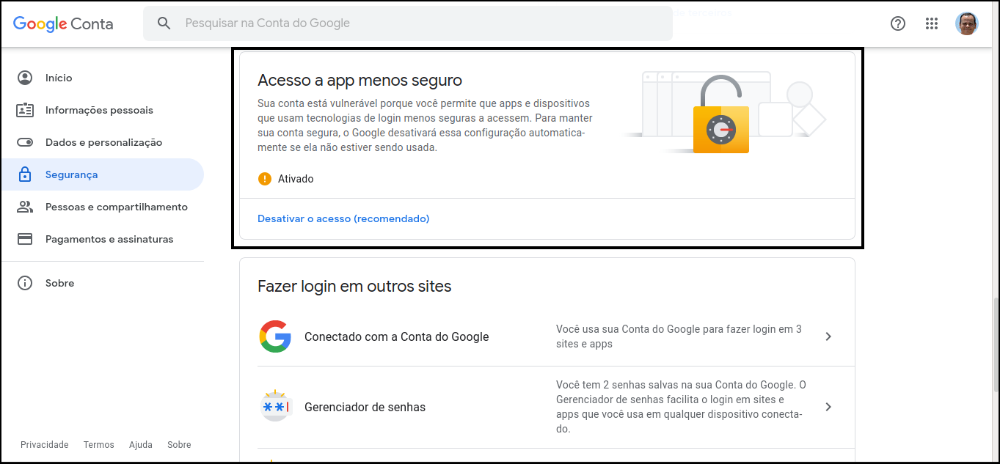

## DESENVOLVIMENTO DE SOFTWARE PARA A WEB 1
**Prof. Delano M. Beder (UFSCar)**

**Envio de *emails***

- - -

#### 02 - Envio de *emails* (Gmail SMTP)
[Código](https://github.com/delanobeder/DSW1/blob/master/SendMail/GmailSMTP)

- - -


1. É necessário ter uma conta (endereço) Gmail: [username]@gmail.com
    Obs: os emails institucionais ([username]@estudante.ufscar.br) também podem ser utilizados 

2. Atualize o arquivo **src/main/resources/config.properties** com informações do cadastro (*username* e *password*)

   ```properties
   mail.smtp.host = smtp.gmail.com
   mail.smtp.port = 465
   mail.smtp.ssl.enable = true
   mail.smtp.auth = true
   username = [username]@gmail.com
   password = <password>
   ```
   
3. Caso a **<u>Verificação em duas etapas</u>** esteja desativada, é necessário ativar o **<u>Acesso a app menos seguro</u>** para permitir que seu programa Java acesse o Gmail SMTP

    

        

<div style="page-break-after: always"></div>

4. Caso a **<u>Verificação em duas etapas</u>** esteja ativada, é necessário criar uma **Senha de app** para permitir que seu programa Java acesse o Gmail SMTP. Utilize essa senha no arquivo **config.properties** discutido anteriormente.

    Maiores informações: https://support.google.com/accounts/answer/185833?hl=pt-BR

    

    

5. Atualize o arquivo **src/main/java/br/ufscar/dc/dsw/Main.java** com endereços válidos (Variáveis **from** e **to**). O endereço **from** deve ser [username]@gmail.com (ou [username]@estudante.ufscar.br) usado no acesso ao Gmail SMTP.

    ```java
    package br.ufscar.dc.dsw;
    
    import java.io.File;
    import java.io.UnsupportedEncodingException;
    import javax.mail.internet.InternetAddress;
    
    public class Main {
    	public static void main(String[] args) throws UnsupportedEncodingException {
    		InternetAddress from = new InternetAddress("<username>@gmail.com", "Fulano");
    		InternetAddress to = new InternetAddress("<email>@<dominio>", "Beltrano");
    		
    		String subject1 = "Exemplo Subject (Gmail SMTP/Java)";
    		String subject2 = "Exemplo Subject com Anexo (Gmail SMTP/Java)";
    		String body1 = "Exemplo mensagem (Gmail SMTP/Java)";
    		String body2 = "Exemplo mensagem com Anexo (Gmail SMTP/Java)";
    
    		// Envio sem anexo
    		EmailService.send(from, to, subject1, body1);
    		// Envio com anexo
    		EmailService.send(from, to, subject2, body2, new File("SIGA.pdf"));
    	}
    }
    ```

6. Abrir um terminal dentro da pasta do projeto e executar os seguintes comandos:

    ```sh
    % ./mvnw compile
    % ./mvnw exec:java
    ```

7. Verificar se duas mensagens foram enviadas e recebidas. Abrir o *inbox* do endereço setado na variável **to**. 

8. Fim


#### Leituras adicionais

- - -
- How To Send Email In Java Using Gmail SMTP?

  https://netcorecloud.com/tutorials/send-email-in-java-using-gmail-smtp/